# Connected Vehicle Telemetry Streaming Pipeline (Kafka + MongoDB + Grafana)


## What This Project Demonstrates


• Real-time vehicle telemetry streaming using **Apache Kafka**  

• Event validation and routing using a **Python stream processor**  

• Storage of high-frequency telemetry data in **MongoDB (NoSQL)**  

• Exposure of time-series data via **FastAPI endpoints**  

• Real-time observability dashboards built with **Grafana**  

• Practical architecture used in **connected vehicle / IoT data platforms**


**Project Type:** Real-Time Data Engineering Pipeline  

**Domain:** Connected Vehicle / Automotive Analytics


# Real-time vehicle telemetry ingestion pipeline using Kafka, MongoDB, and Grafana


This project simulates connected vehicle telemetry streaming and demonstrates how automotive data platforms ingest, validate, store, and visualize real-time sensor data.
The pipeline mimics how modern mobility platforms process vehicle telemetry streams from thousands of cars.

## Architecture

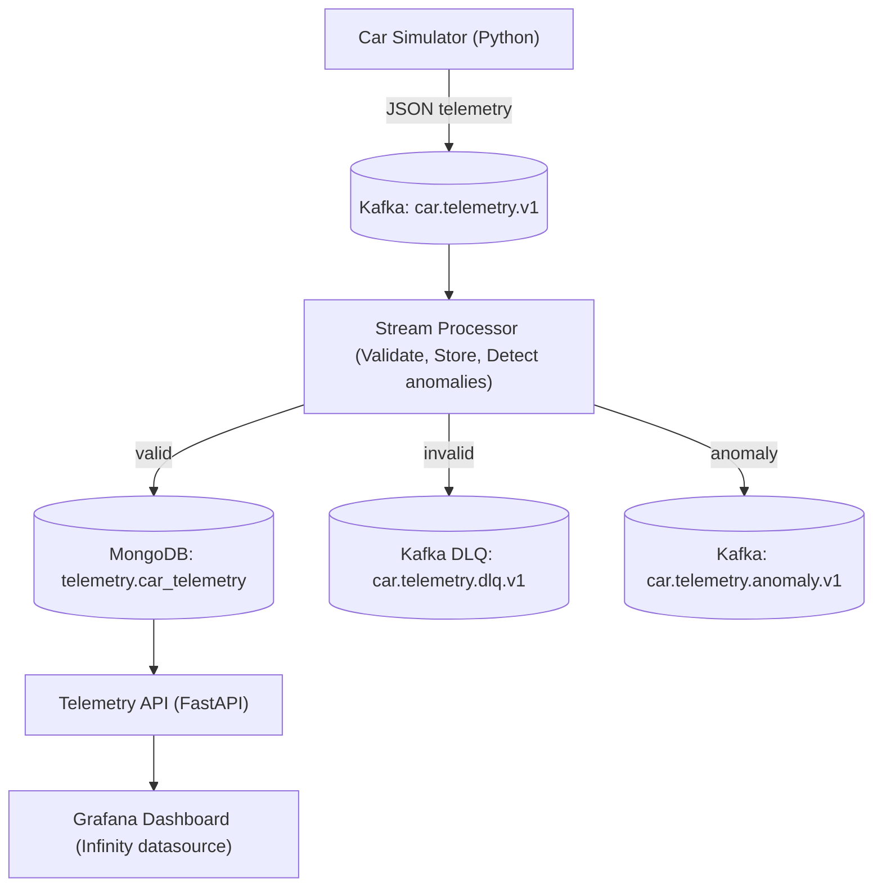
### Data Flow

Simulator → Kafka → Stream Processor → MongoDB → API → Grafana

## Data Flow Summary

The system simulates connected vehicles sending real-time telemetry data through a streaming data platform.

1. **Vehicle Simulator** generates telemetry events (speed, RPM, engine temperature, fuel level, GPS coordinates).
2. **Apache Kafka** ingests telemetry streams through the topic `car.telemetry.v1`.
3. A **stream processor** validates events, stores valid telemetry in MongoDB, and routes invalid events to a Dead Letter Queue.
4. **Pipeline metrics** and anomaly events are emitted into Kafka for monitoring and observability.
5. **FastAPI** exposes telemetry and pipeline metrics for visualization.
6. **Grafana dashboards** display fleet location, vehicle telemetry, anomaly detection, and pipeline health in real time.


## System Architecture Overview


The pipeline simulates how connected vehicle platforms process real-time telemetry streams from vehicles.


1. **Telemetry Simulation**  
    A Python-based car simulator generates realistic vehicle sensor data including speed, RPM, engine temperature, fuel level, and GPS coordinates.

2. **Event Streaming with Kafka**  
    Telemetry events are published into Kafka topics where they act as a scalable ingestion layer for high-throughput vehicle data streams.

3. **Stream Processing Layer**  
    A Python Kafka consumer validates incoming telemetry events, routes invalid events to a Dead Letter Queue (DLQ), and stores valid telemetry data in MongoDB.

4. **Telemetry Storage**  
    MongoDB stores telemetry as JSON documents optimized for time-series queries using compound indexes on vehicle ID and timestamp.

5. **Telemetry API Layer**  
    A FastAPI service exposes REST endpoints that provide time-series telemetry data for visualization.
6. **Monitoring Dashboard**  
    Grafana dashboards consume telemetry data via the API to visualize vehicle metrics and anomaly detection in real time.


## Technologies Used

| Layer | Technology |
|------|-----------|
| 🚗 Simulation | Python |
| 📡 Streaming | Apache Kafka |
| ⚙️ Stream Processing | Python Kafka Consumer |
| 🗄 Database | MongoDB |
| 🔌 API Layer | FastAPI |
| 📊 Visualization | Grafana |
| 🐳 Infrastructure | Docker |


## Example Telemetry Event


{
"car_id": "CAR_001",

"timestamp": "2026-02-25T21:28:17.376062+00:00",

"speed": 59.83,

"rpm": 2947,

"engine_temp": 95.79,

"fuel_level": 33.73,

"latitude": 52.486,

"longitude": 13.484548

}

## Features


Real-time Vehicle Telemetry Simulation

Python simulator generates realistic sensor streams including:

* Vehicle speed
* Engine RPM
* Engine temperature
* Fuel level
* GPS coordinates


## Kafka Event Streaming


Telemetry events are published into Kafka topics.


car.telemetry.v1

car.telemetry.dlq.v1

car.telemetry.anomaly.v1


Kafka acts as a high-throughput event ingestion layer.


### Anomaly Topic Consumer


Example events consumed from the anomaly detection topic.


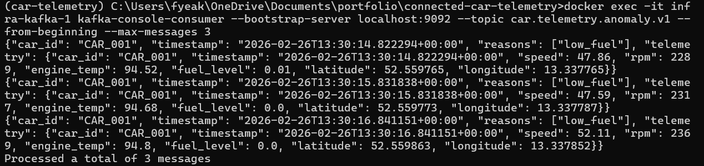


## Stream Processing & Validation


Consumer services perform:


- Schema validation

- Range validation

- Event routing


Valid events → MongoDB  

Invalid events → Dead Letter Queue (DLQ)


### Stream Processor


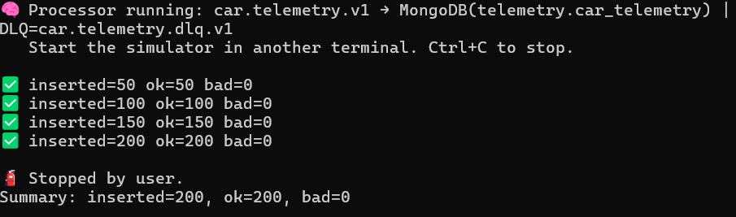


### Event Validation Logs


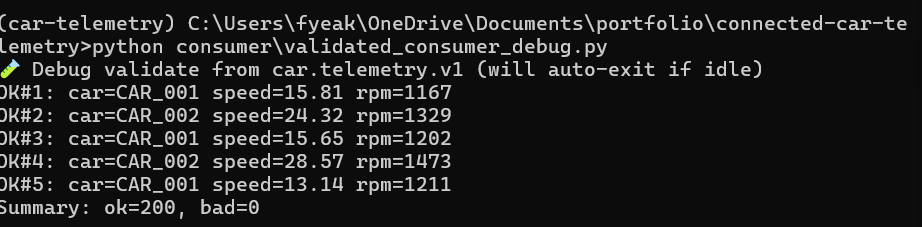


## NoSQL Telemetry Storage


MongoDB stores telemetry as JSON documents optimized for time-series queries.


Indexes used:


- `car_id + timestamp`

- `timestamp`


### Telemetry Ingestion


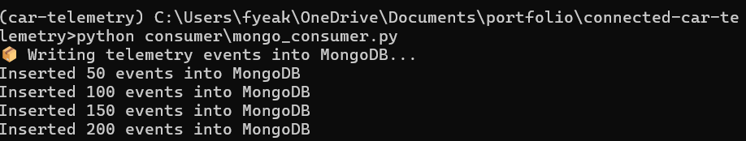


### Sample Telemetry Documents


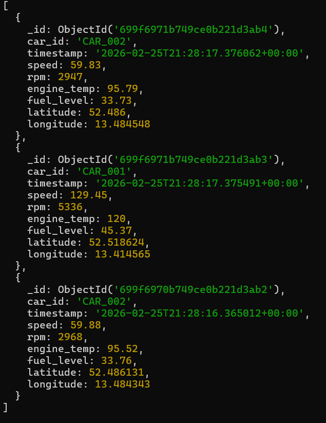


### MongoDB Indexes


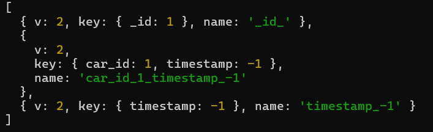


## Telemetry API


A lightweight FastAPI service exposes endpoints for analytics and dashboards.


Example endpoint:


/series/speed?car_id=CAR_001


Returns time-series data used by Grafana dashboards.


### API Speed Series Endpoint


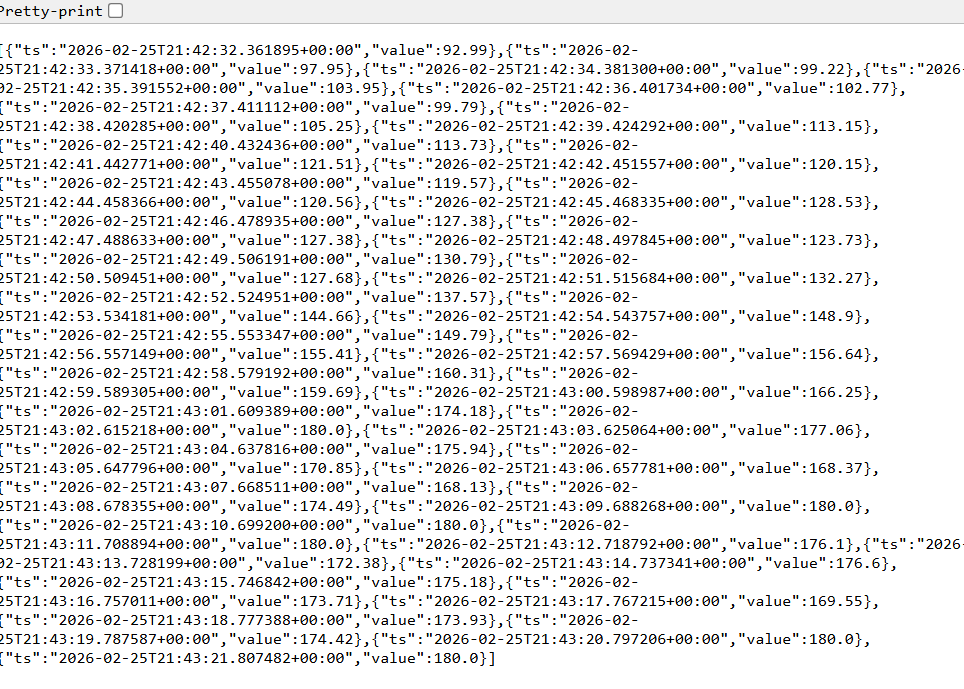


## Dashboard Visualization


### Live Fleet Map

Real-time vehicle monitoring showing the latest GPS location of each connected vehicle.

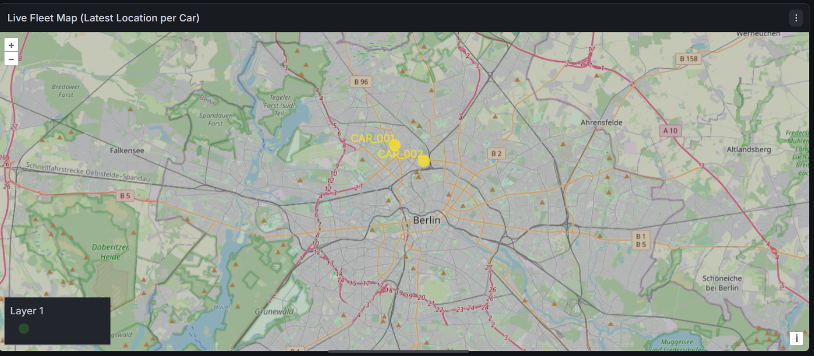


### Vehicle Speed Telemetry


Real-time vehicle speed visualization powered by the Telemetry API and Grafana.


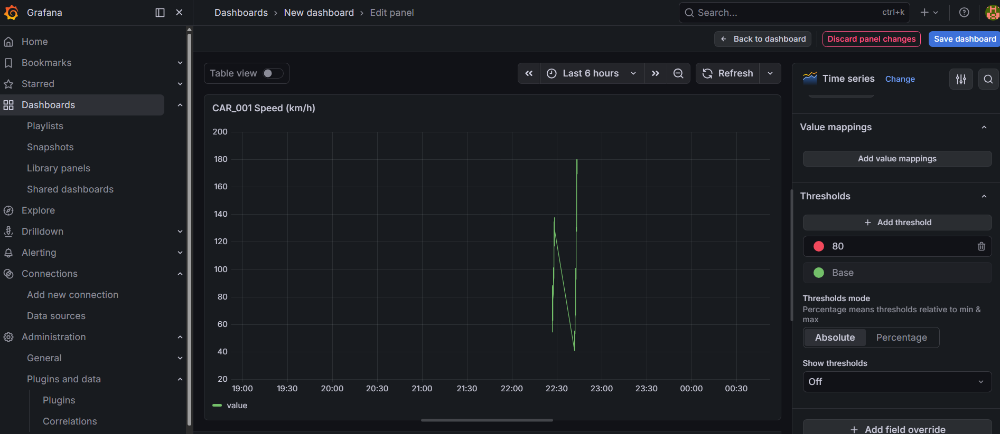


### Anomaly Detection (10-second aggregation)


Anomalous telemetry events aggregated into 10-second windows for real-time monitoring.


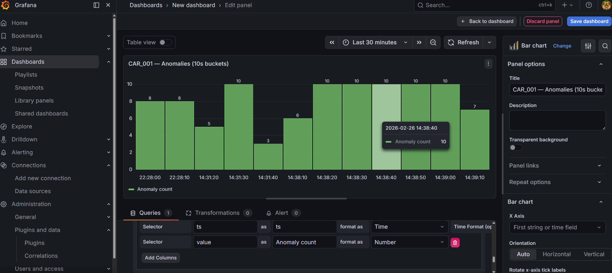


### Pipeline Health Monitoring

Operational metrics from the telemetry ingestion pipeline including processed events, valid events, anomaly detections, and DLQ counts.

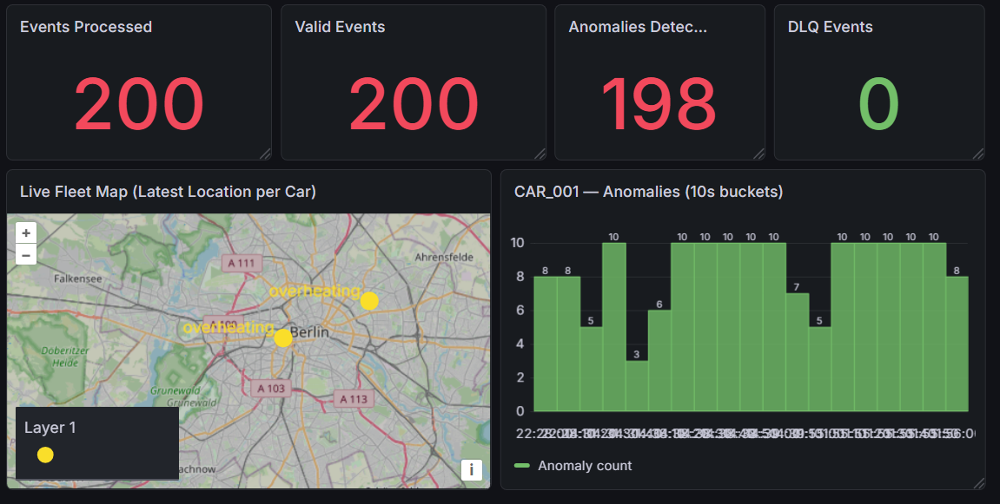


### 1. Start Infrastructure

```bash

docker compose -f infra/docker-compose.yml up -d

```

### 2. Run Telemetry Simulator

```bash
python producer/car_simulator.py

```

### 3. Run Stream Processor

```bash

python consumer/processor_mongo_dlq.py

```

### 4. Open Monitoring Dashboard

```bash

http://localhost:3000

```


## Learning Objectives


This project demonstrates practical experience with:

* Event streaming pipelines
* IoT telemetry ingestion
* Data validation pipelines
* NoSQL storage patterns
* Observability dashboards


## Future Improvements

Possible extensions:

* Spark streaming analytics
* Geospatial vehicle tracking
* Fleet analytics dashboards
* Real-time anomaly detection

## Author


Pattarin Thunyapar

Master's in Data Analytics  

Berlin, Germany  


Interested in:

- Data Engineering

- Real-time analytics

- AI \& Intelligent Systems


